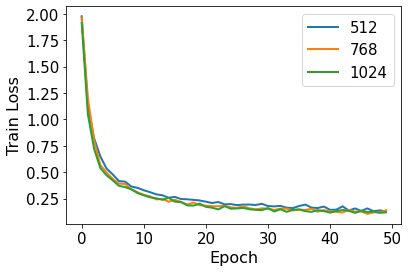
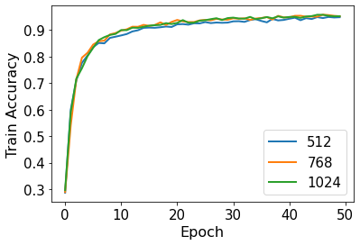
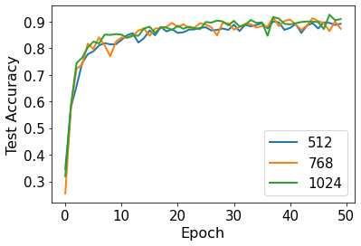
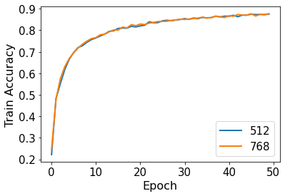
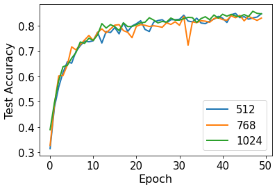
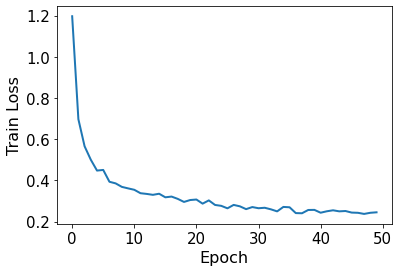
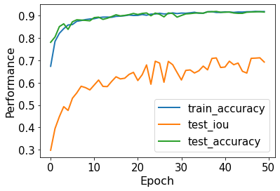

# 3D Recognition

## Code Structure

See implementation details / instructions to run code in individual readme's

**Tasks:** 3D Classification and Segmentation

**Datasets:** ModelNet-10, ModelNet-100, ShapeNet

## PointNet

The following experiments used a learning rate of 0.001, and 10 epochs. We vary the number of points sampled from the training and testing examples. All other hyper-parameters are not those reccommended in the paper.

### ModelNet10
|   | OA |
|:-|:-:|
| 512 | 86.23 |
| 1024 | 87.89 |
| 2048 | 86.01 |

### ModelNet40

### ShapeNet

The ShapeNet models were only trained using 1024 points.

**ShapeNet OA:** 94.29%

**ShapeNet mIOU:** 80.43%

## PointNet++

The code for training and evaluating the PointNet++ model is loacted [here](https://github.com/395t/coding-assignment-week-11-3dr-1/tree/main/src/pointnet2). Follow the instructions in the readme there to run the code. We train the model for classification on ModelNet10 and ModelNet40, and for segmentation on ShapeNet. The hyper-paramaters used for reporting the following results are:

* Epochs = 50
* Optimizer = Adam
* Learning Rate = 0.001
* Dropout Rate = 0.5
* Number of Points from (512, 768, 1024)

The following table provides an overall comparison of the performance of the model on the 3 datasets:

| Dataset  | Number of Points | Test Accuracy | Test IoU |
|:-|:-:|:-:|
| ModelNet10 | 1024 | 92.73 |  |
| ModelNet10 | 768 | 91.63 |  |
| ModelNet10 | 512 | 90.09 |  |
| ModelNet40 | 1024 | 85.70 |  |
| ModelNet40 | 768 | 84.08 |  |
| ModelNet40 | 512 | 84.85 |  |
| ShapeNet | 1024 | 91.87 | 71.13 |

Next, we examine how the performance of the model varies with training iterations on both train and test sets. The plots also illustrate a comparison of the convergence properties with different number of points.

### ModelNet10

  
  
  

### ModelNet40

  
  
  

### ShapeNet

  
  

## Dynamic Graph CNN

For all of the following experiments, the model is trained for 30 epochs using SGD as the optimizer. A learning rate of 0.001 is used with a momentum of 0.9 and a dropout rate of 0.5. We keep the default ratio of 1024:20 for the number of points to number of nearest neighbors. We ablate the number of points.

### ModelNet10
|   | mAcc | OA |
|:-|:-:|:-:|
| 512  | 93.81 | 94.05 |
| 1024 | 93.68 | 93.83 |
| 2048 | 93.96 | 94.05 |

### ShapeNet
|   | mAcc | OA |
|:-|:-:|:-:|
| 512  | 74.98 | 92.56 |
| 1024 | 77.85 | 93.58 |
| 2048 | 76.11 | 91.82 |

### Segmentation Task Example

## PointCNN    
### Classification   
#### Model Details  
#### ModelNet10
| Points  | OA | Duration |
|:-|:-:|:-:|
| 512  | 89.32 | 1:03:30 |
| 1024 | 90.16 | 1:34:55 |
| 2048 | 89.96 | 2:41:39 |  

  

#### ModelNet40
| Points  | OA | Duration |
|:-|:-:|:-:|
| 512  | 0 | 0 |
| 1024 | 0 | 0 |
| 2048 | 0 | 0 |  

### Segmentation  
#### Model Details  

## Point Transformer

### ModelNet40

We report the mean accuracy within each category (mAcc) and the overall accuracy (OA) in all instances.

For each experiment, we train the model for 20 epochs (except for the default setting). For the default setting, the model is trained for 150 epochs using Adam optimizer with 0.001 learning rate and batch size of 8. The number of points is 1024. Using these hyperparameters, we get 66.08 on mAcc and 57.85 on OA.

We also ablate some of the hyperparameters, including number of points used and the learning rate. 

#### Number of Points
|   | mAcc  | OA  |
|:-|:-:|:-:|
|  1024 (150 epochs) | 66.08  | 57.85  |
|  1024 (20 epochs) |  49.71 |  39.72 |
|  512 | 32.29  |  21.11 |
|  256 |  30.34 | 20.72  |

#### Learning Rate 
|   | mAcc  | OA  |
|:-|:-:|:-:|
|  1e-3 (150 epochs) | 66.08  | 57.85  |
|  1e-3 (20 epochs) |  49.71 |  39.72 |
|  2e-4 |  |   |
|  5e-3 |   |   |

### ModelNet10

Following ModelNet40, we train the model for 20 epochs, and the default hyperparameters are unchanged. Using the default hyperparameters, we get 66.08 on mAcc and 57.85 on OA. (We can only train for 45 epochs due to resource constraints.)

We again ablate number of points used and the learning rate. 

#### Number of Points
|   | mAcc  | OA  |
|:-|:-:|:-:|
|  1024 (45 epochs) |   70.59 | 65.67  |
|  1024 (20 epochs) |  67.84	| 63.32  |
|  512 |  58.15	 | 54.29  |
|  256 |  41.52	| 37.58  |

#### Learning Rate 
|   | mAcc  | OA  |
|:-|:-:|:-:|
|  1e-3 (20 epochs) |  67.84	| 63.32|
|  2e-4 | 91.85  | 91.36  |
|  5e-3 |  10.96 | 10.00  |

### ShapeNet

For ShapeNet, we also train the model for 20 epochs, and the default hyperparameters follow that of modelNet40 and 10. Using the default hyperparameters, we get 66.08 on mAcc and 57.85 on OA. (Also trained for 45 epochs, following modelNet10)

We again ablate number of points used and the learning rate. 

#### Number of Points
|   | Acc  | meanIOU  | InstanceIOU | 
|:-|:-:|:-:|:-:|
|  1024 (40 epochs) |  90.97	|  72.29 |	79.64   |
|  1024 (20 epochs) | 87.32  | 64.79  | 73.98 |
|  512 |  88.63 |	67.88	| 75.86 |
|  256 | 88.69 | 67.99  | 76.05 |

#### Learning Rate 
|   | Acc  | meanIOU  | InstanceIOU | 
|:-|:-:|:-:|:-:|
|  1e-3 (20 epochs) | 87.32  | 64.79  | 73.98 |
|  2e-4 |   |   |  |
|  5e-3 |   |  |  |
